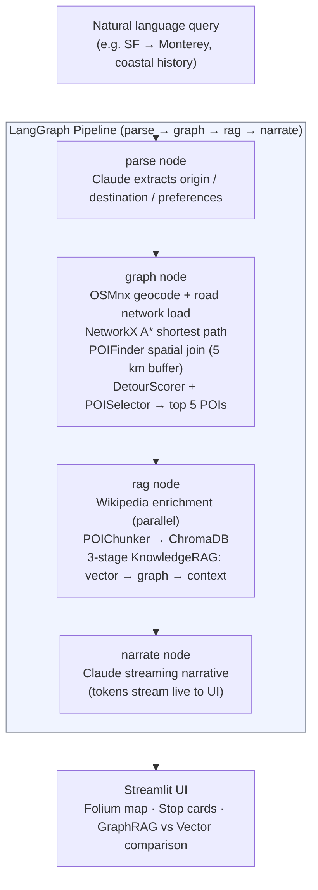
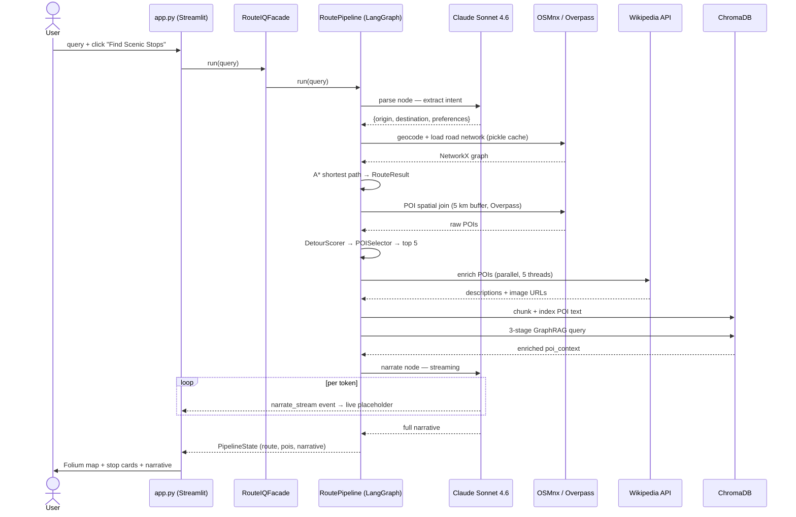
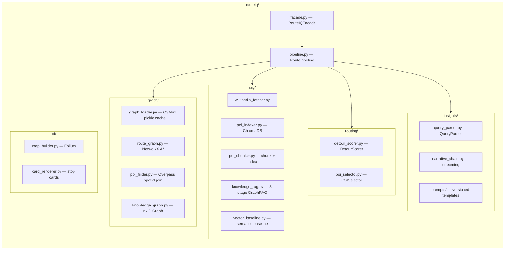

# RouteIQ

> Scenic route intelligence: ask a natural-language question, get a map with curated stops and a Claude-generated narrative — powered by Graph RAG over OSM road networks and Wikipedia.


---

## Quick Start

```bash
git clone <repo-url>
cd routeiq
pip install -r requirements.txt
echo "ANTHROPIC_API_KEY=sk-ant-..." > .env
streamlit run app.py
```

**Required environment variable:**

| Variable | Description |
|---|---|
| `ANTHROPIC_API_KEY` | Anthropic API key — used for query parsing and narrative generation |

> **First query:** ~30–60 s while OSMnx downloads the road network for the corridor and Overpass fetches POIs. Both are cached to `cache/` — subsequent queries for the same corridor take ~5 s.

---

## What it does

RouteIQ answers natural-language scenic route questions like *"Drive from San Francisco to Muir Woods, show redwoods and coastal views."* It loads the real road network from OpenStreetMap, finds the A\* shortest path, spatially joins points of interest within a 5 km corridor buffer, enriches them with Wikipedia descriptions, and runs a 3-stage Graph RAG pipeline (vector search → knowledge graph augmentation → context assembly) before asking Claude to generate a streaming narrative. The result is an interactive Folium map with animated route, colour-coded stop markers, stop cards with Wikipedia images, and side-by-side GraphRAG vs. vector-only comparison.

---

## Architecture

### App layers



### Request sequence



### Module layout



---

## Design Patterns Applied

| Pattern | Where |
|---|---|
| **Facade** | `RouteIQFacade` ([routeiq/facade.py](routeiq/facade.py)) — single entry point that wires all components; callers only need `facade.run(query)` |
| **Pipeline** | `RoutePipeline` ([routeiq/pipeline.py](routeiq/pipeline.py)) and `KnowledgeRAG` ([routeiq/rag/knowledge_rag.py](routeiq/rag/knowledge_rag.py)) — named nodes, shared typed state, conditional edges |
| **Strategy** | `DetourScorer` ([routeiq/routing/detour_scorer.py](routeiq/routing/detour_scorer.py)) — interchangeable scoring algorithm; `POISelector` applies category-aware selection |
| **Registry** | `RouteKnowledgeGraph` ([routeiq/graph/knowledge_graph.py](routeiq/graph/knowledge_graph.py)) — typed node/edge graph of POI, City, Region, Category entities with LOCATED\_IN / HAS\_CATEGORY / NEAR\_POI edges |
| **Builder** | `MapBuilder` ([routeiq/ui/map_builder.py](routeiq/ui/map_builder.py)) — assembles Folium map with AntPath route, colour-coded markers, and popups |
| **Dependency Injection** | LLM (`ChatAnthropic`) and `ChromaDB` client injected into all AI components — every class is independently testable with mocks |

---

## LangGraph Pipeline

[routeiq/pipeline.py](routeiq/pipeline.py) implements the four-node state machine using LangGraph's `StateGraph`.

**What LangGraph is:** a typed workflow engine for LLM pipelines. You define nodes (units of work), edges (routing), and one shared `TypedDict` state that every node reads from and writes to. `compile()` turns that definition into a single invokable graph — equivalent to AWS Step Functions but for LLM/tool call chains.

**Graph topology:**

```
PipelineState (TypedDict — one shared DTO)
  query · origin · destination · preferences
  route_result · pois · top_pois · poi_context
  narrative · error · fallback_reason

parse ──[conditional]──▶ graph ──[conditional]──▶ rag ──▶ narrate ──▶ END
          ↘ on error                ↘ on error
           └─────────────────────────────────────▶ narrate (FallbackChain)
```

**What it adds over plain Python function calls:**

| Plain Python | LangGraph |
|---|---|
| Error routing scattered across every caller | Any node sets `state["error"]` → conditional edge auto-routes to fallback |
| Each function returns a dict; caller merges fields | All nodes share one typed `PipelineState` — no merge boilerplate |
| Adding a step = refactoring the call chain | Add one node + one edge — existing nodes untouched |
| Wiring (who calls who) is implicit in call order | Graph topology is explicit and auditable in `_build_graph()` |
| LangSmith tracing requires manual instrumentation | Drop-in with `LANGCHAIN_TRACING_V2=true` |

**Tradeoff:** For a strictly linear pipeline, LangGraph is slightly more ceremony than chaining functions. The payoff is in the conditional edges and extensibility — adding a caching node, a retry loop, or a human-review gate between any two steps is one `add_node` + one `add_edge` call.

---

## Testing

```bash
python3 -m pytest tests/ -v
```

**127 tests, 16 test files** — one per module. Coverage includes:

| Area | Tests |
|---|---|
| Graph loading + pickle cache migration | `test_graph_loader.py` |
| A\* pathfinding | `test_route_graph.py` |
| POI spatial join | `test_poi_finder.py` |
| Knowledge graph edges + enrichment | `test_knowledge_graph.py` |
| Detour scoring + POI selection | `test_detour_scorer.py`, `test_poi_selector.py` |
| Wikipedia fetch + enrichment | `test_wikipedia_fetcher.py` |
| ChromaDB indexing + retrieval | `test_poi_indexer.py`, `test_poi_retriever.py` |
| POI chunking | `test_poi_chunker.py` |
| 3-stage GraphRAG pipeline | `test_knowledge_rag.py` |
| Query parser (Claude, mocked) | `test_query_parser.py` |
| Narrative chain — generate + stream | `test_narrative_chain.py` |
| LangGraph pipeline nodes + edges | `test_pipeline.py` |
| Vector baseline | `test_vector_baseline.py` |
| Fallback chain | `test_fallback_chain.py` |

---

## Evaluation

Runs a 10-query comparison of GraphRAG vs. vector-only baseline and saves results to `eval/results.md`.

```bash
export ANTHROPIC_API_KEY=sk-ant-...
python3 eval/run_eval.py
```

**Requirements:** `ANTHROPIC_API_KEY` · ~15 min runtime · ~$0.05–0.10 API cost (6 LLM calls for route queries)

**What it does:**
- Runs 6 route queries through the full GraphRAG pipeline
- Runs all 10 queries through the vector baseline (95 notable Bay Area POIs, Wikipedia-enriched)
- Compares POI overlap and uniqueness, determines winner per query
- Prints a results table and saves `eval/results.md`

**Vector baseline seed:** `eval/evaluator.py` loads 95 OSM-verified notable Bay Area landmarks
from `cache/pois/bay_area_all.json.gz` (wikipedia-tagged POIs only) and Wikipedia-enriches
them at startup. To regenerate the master POI file:

```bash
python3 scripts/seed_poi_cache.py           # bootstrap from existing per-route caches
python3 scripts/seed_poi_cache.py --tiles   # full 4-tile Overpass fetch (~3-5 min)
```

**Latest results:** See [eval/results.md](eval/results.md) — GraphRAG wins 6/6 route queries,
vector wins 4/4 semantic queries, 10/10 prediction accuracy.

---

## Project Structure

```
routeiq/
  graph/
    graph_loader.py       OSMnx road network download + pickle cache (auto-migrates .graphml)
    route_graph.py        NetworkX A* shortest path
    poi_finder.py         Overpass POI query + 5 km corridor spatial join
    knowledge_graph.py    nx.DiGraph of POI/City/Region/Category entities
    knowledge_graph_data.py  Seed data for Bay Area nodes and relationships
    poi.py                POI dataclass (name, category, lat/lon, description, image_url)
    route_result.py       RouteResult dataclass (coords, length_km, drive_time_min)
  rag/
    wikipedia_fetcher.py  Wikipedia intro + thumbnail URL per POI (15 s timeout)
    poi_indexer.py        ChromaDB collection management + upsert
    poi_chunker.py        Splits POI descriptions into sentence-level chunks for indexing
    knowledge_rag.py      3-stage GraphRAG: vector search → graph augment → context string
    poi_retriever.py      Semantic retrieval by POI ID
    vector_baseline.py    Pure semantic baseline (no graph) for evaluation comparison
  routing/
    detour_scorer.py      Straight-line round-trip detour cost per POI (Strategy)
    poi_selector.py       Top-N selection with category preference weighting
    scored_poi.py         ScoredPOI dataclass (POI + detour_min + score)
  insights/
    query_parser.py       NL query → {origin, destination, preferences} via Claude
    narrative_chain.py    Route + POIs → streaming narrative via Claude
    fallback_chain.py     Error/no-result graceful response
    prompts/              Versioned ChatPromptTemplates (QUERY_PARSER_PROMPT, NARRATIVE_PROMPT_V3)
    examples/             Few-shot examples as plain dicts
  ui/
    map_builder.py        Folium map with AntPath route + CircleMarker POIs (Builder)
    card_renderer.py      Stop card HTML (name, detour, Wikipedia image, description)
  facade.py               RouteIQFacade — single DI entry point
  pipeline.py             RoutePipeline — LangGraph state machine
app.py                    Streamlit UI (deferred imports, bg init, streaming placeholder)
eval/
  evaluator.py            10-query GraphRAG vs vector baseline evaluation harness
  eval_queries.py         Bay Area query set
  run_eval.py             CLI runner
tests/                    124 unit tests
docs/                     Architecture decisions, learnings log
prompts.md                Running log of all prompts used in development
requirements.txt          Python dependencies
restart.sh                Cache-safe restart (preserves graph + POI cache)
```

---

## Documentation

| File | Contents |
|---|---|
| [docs/learnings.md](docs/learnings.md) | Key learnings across all sessions — graph retrieval vs. vector, performance wins, design decisions |
| [docs/Architecture-and-Design-Decisions.md](docs/Architecture-and-Design-Decisions.md) | Full architecture rationale and design choices |
| [docs/RAG-and-GraphRAG-Explained.md](docs/RAG-and-GraphRAG-Explained.md) | Plain-English explanation of the GraphRAG approach |
| [prompts.md](prompts.md) | Every prompt iteration with what changed and why |

---

Built with [OSMnx](https://osmnx.readthedocs.io) · [NetworkX](https://networkx.org) · [LangGraph](https://langchain-ai.github.io/langgraph/) · [ChromaDB](https://docs.trychroma.com) · [LangChain](https://python.langchain.com) · [Claude Sonnet 4.6](https://anthropic.com) · [Folium](https://python-visualization.github.io/folium/) · [Streamlit](https://streamlit.io)
