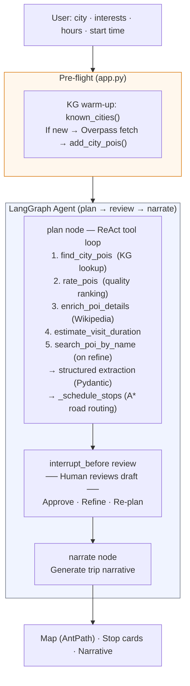
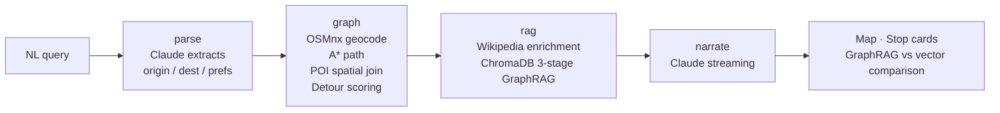
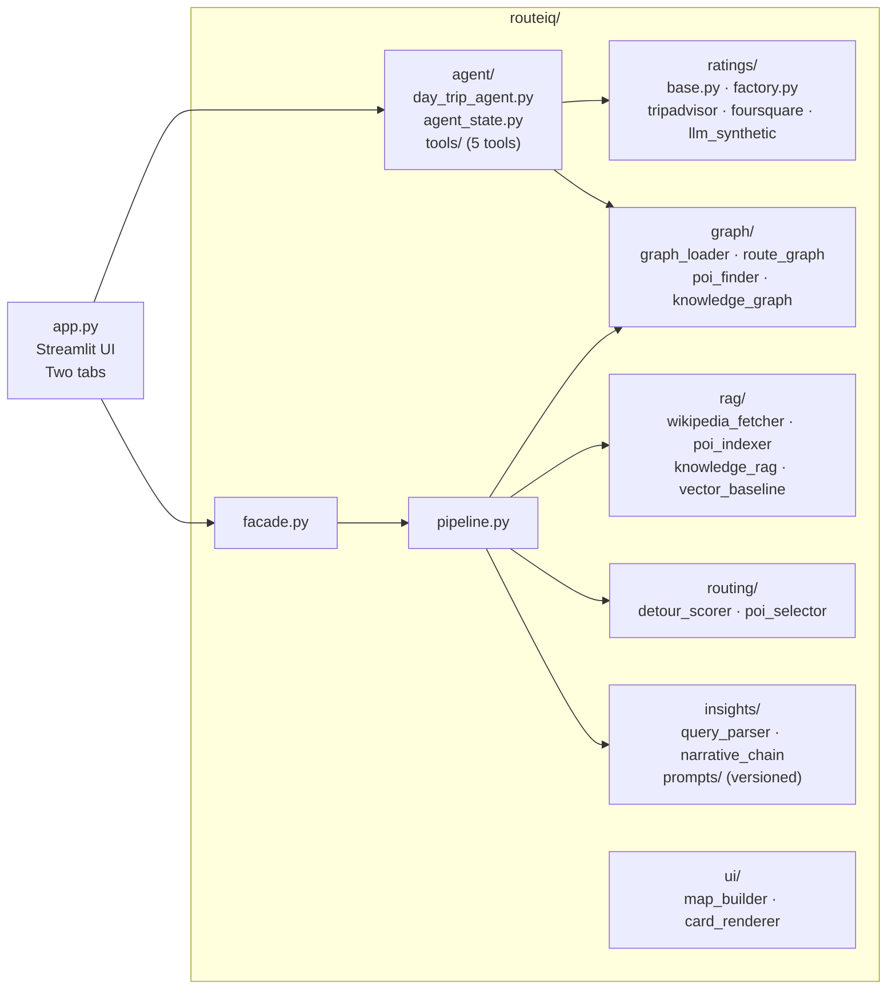

# RouteIQ

> An agentic day-trip planner and scenic route explorer: describe a city or route in plain language, get a map-rendered, time-scheduled itinerary with real POI ratings, Wikipedia context, and a generated narrative — powered by a LangGraph ReAct agent, Graph RAG over OSM road networks, and a multi-source ratings layer.

<!-- Run /generate-demo-gif to produce this -->
<!--  -->

---

## Quick Start

```bash
git clone <repo-url>
cd routeiq
pip install -r requirements.txt
cp .env.example .env          # edit with your API key
streamlit run app.py
```

**Required environment variables** (set in `.env`):

| Variable | Default | Description |
|---|---|---|
| `LLM_PROVIDER` | `anthropic` | `anthropic` or `nebius` |
| `LLM_MODEL` | `claude-sonnet-4-6` | Model name for the chosen provider |
| `ANTHROPIC_API_KEY` | — | Required when `LLM_PROVIDER=anthropic` |
| `NEBIUS_API_KEY` | — | Required when `LLM_PROVIDER=nebius` |
| `NEBIUS_API_BASE` | — | Required when `LLM_PROVIDER=nebius` |
| `RATING_PROVIDER` | `llm_synthetic` | `llm_synthetic` · `tripadvisor` · `foursquare` |

> **Bay Area cities load instantly** — road graphs, POI data, and rating caches for San Francisco, Oakland, Berkeley, San Jose, and Santa Cruz are bundled. Other cities trigger a one-time Overpass fetch (~15–30 s), then cache locally.

---

## What It Does

**Tab 1 — Day Trip Planner (Agent):** Enter a city, pick interests, hours, and start time. A LangGraph ReAct agent calls five tools to find, rank, and enrich Points of Interest, then schedules them in road-time-accurate order using A\* pathfinding. A human-in-the-loop interrupt lets you review the draft map + stop cards, refine with natural language ("Add Lombard Street", "Skip museums"), and approve before the narrative is written.

**Tab 2 — Route Planner (GraphRAG):** Ask a scenic route question ("Drive SF → Muir Woods, show redwoods and coastal views"). A LangGraph pipeline parses the query, loads the OSM road network, spatially joins POIs along the corridor, enriches them with Wikipedia, runs a 3-stage Graph RAG retrieval, and generates a streaming narrative with a Folium map and stop cards.

Both tabs support any city or route — Bay Area corridors are instant, other regions download on first use.

---

## Architecture

### Day Trip Planner — Agent Flow



### Route Planner — Pipeline Flow



### Ratings Layer

```
rate_pois tool
      │
      ├─── TripAdvisorRatingProvider   (primary — key pending)
      ├─── FoursquareRatingProvider    (secondary)
      └─── LLMSyntheticRatingProvider  (active fallback — disk-cached, 21-day TTL)
                │
                ▼
    composite_score = 0.4 × (rating/5) + 0.3 × log(reviews) + 0.3 × wikipedia_weight
    Top 30 returned → LLM selects 8–10 matching user preferences
```

### Module Layout



---

## Design Patterns Applied

| Pattern | Where |
|---|---|
| **Pipeline** | `RoutePipeline` ([routeiq/pipeline.py](routeiq/pipeline.py)) — LangGraph state machine: parse → graph → rag → narrate with conditional edges. `DayTripAgent` — plan → review → narrate with `interrupt_before`. |
| **Strategy** | `POIRatingProvider` ABC ([routeiq/ratings/base.py](routeiq/ratings/base.py)) — `TripAdvisorRatingProvider`, `FoursquareRatingProvider`, `LLMSyntheticRatingProvider` are interchangeable via `RATING_PROVIDER` env var. `DetourScorer` ([routeiq/routing/detour_scorer.py](routeiq/routing/detour_scorer.py)) — swappable scoring algorithm. |
| **Factory** | `RatingsFactory` ([routeiq/ratings/factory.py](routeiq/ratings/factory.py)) — constructs the active rating provider from env var. |
| **Facade** | `RouteIQFacade` ([routeiq/facade.py](routeiq/facade.py)) — single entry point for the Route Planner; callers only need `facade.run(query)`. |
| **Registry** | `RouteKnowledgeGraph` ([routeiq/graph/knowledge_graph.py](routeiq/graph/knowledge_graph.py)) — typed node/edge graph of POI, City, Region, Category with LOCATED\_IN / HAS\_CATEGORY / NEAR\_POI edges. `get_kg()` singleton ensures all callers share one in-memory graph. |
| **Builder** | `MapBuilder` ([routeiq/ui/map_builder.py](routeiq/ui/map_builder.py)) — assembles Folium map with AntPath route, numbered markers, and stop popups. |
| **Dependency Injection** | LLM (`ChatAnthropic` / `ChatOpenAI`) injected into all AI components — every class is independently testable with mocks. |

---

## Testing

```bash
python3 -m pytest tests/ -v
```

**213 tests across 22 test files.** Coverage includes:

| Area | Test files |
|---|---|
| Day Trip Agent — scheduling, budget trimming, ReAct loop | `tests/agent/test_day_trip_agent.py` |
| Agent tools — find POIs, rate, enrich, search by name | `tests/agent/test_tools.py` |
| Ratings — TripAdvisor, Foursquare, LLM synthetic, factory | `tests/ratings/` (4 files) |
| Graph loading + pickle cache | `test_graph_loader.py` |
| A\* pathfinding | `test_route_graph.py` |
| POI spatial join | `test_poi_finder.py` |
| Knowledge graph — edges, enrichment, city expansion | `test_knowledge_graph.py` |
| Detour scoring + POI selection | `test_detour_scorer.py`, `test_poi_selector.py` |
| Wikipedia fetch + enrichment | `test_wikipedia_fetcher.py` |
| ChromaDB indexing + retrieval | `test_poi_indexer.py`, `test_poi_retriever.py` |
| 3-stage GraphRAG pipeline | `test_knowledge_rag.py` |
| Query parser, narrative chain, fallback | `test_query_parser.py`, `test_narrative_chain.py`, `test_fallback_chain.py` |
| LangGraph pipeline nodes + edges | `test_pipeline.py` |
| Vector baseline | `test_vector_baseline.py` |

---

## Project Structure

```
app.py                        Streamlit UI — Day Trip Planner + Route Planner tabs
routeiq/
  agent/
    day_trip_agent.py         LangGraph ReAct agent — plan / review (interrupt) / narrate nodes
    agent_state.py            DayTripState TypedDict
    tools/
      find_city_pois.py       READ: KG lookup — returns POIs for a city
      rate_pois.py            READ: enriches POIs with ratings, ranks by composite score
      enrich_poi_details.py   READ: Wikipedia intro + thumbnail per POI
      estimate_visit.py       READ: typical visit duration by OSM subtype
      search_poi_by_name.py   READ: Nominatim geocoder — resolves named places to lat/lon
  ratings/
    base.py                   POIRatingProvider ABC + RatedPOI dataclass
    factory.py                RatingsFactory — selects provider from RATING_PROVIDER env var
    llm_synthetic.py          LLM-generated ratings, disk-cached per city, 21-day TTL
    tripadvisor.py            TripAdvisor Terra API adapter
    foursquare.py             Foursquare v2 adapter
  graph/
    knowledge_graph.py        nx.DiGraph of POI/City/Region/Category; get_kg() singleton
    knowledge_graph_data.py   Bay Area seed data
    graph_loader.py           OSMnx road network download + pickle cache
    route_graph.py            NetworkX A* shortest path
    poi_finder.py             Overpass POI query + corridor spatial join + polygon clip
    poi.py                    POI dataclass
    route_result.py           RouteResult dataclass
  rag/
    wikipedia_fetcher.py      Wikipedia intro + thumbnail URL per POI
    poi_indexer.py            ChromaDB collection management
    knowledge_rag.py          3-stage GraphRAG: vector → graph augment → context
    vector_baseline.py        Pure semantic baseline (no graph) for evaluation
  routing/
    detour_scorer.py          Straight-line detour cost per POI (Strategy)
    poi_selector.py           Top-N selection with category weighting
  insights/
    query_parser.py           NL query → {origin, destination, preferences}
    narrative_chain.py        Route + POIs → streaming narrative
    prompts/                  Versioned ChatPromptTemplates
  ui/
    map_builder.py            Folium map with AntPath route + markers (Builder)
    card_renderer.py          Stop card HTML — photos, ratings, visitor quote, hours
  facade.py                   RouteIQFacade — single DI entry point (Route Planner)
  pipeline.py                 RoutePipeline — LangGraph state machine (Route Planner)
  llm_factory.py              create_llm() — Anthropic / Nebius via env var
cache/
  graphs/                     OSMnx road network pickles (Bay Area pre-seeded)
  pois/                       POI JSON.GZ caches (bay_area_all.json.gz + per-route)
  ratings/                    LLM synthetic rating caches per city
  chroma/                     ChromaDB persistent store (pre-populated)
eval/
  evaluator.py                10-query GraphRAG vs vector baseline harness
  run_eval.py                 CLI runner
tests/                        213 unit tests across 22 files
docs/
  README-routeplanner.md      Full Route Planner documentation
  week3-submission.md         Week 3 agent framework + prompts + learnings
```

---

## Evaluation

10-query comparison of Graph RAG vs. vector-only retrieval for the Route Planner:

```bash
export ANTHROPIC_API_KEY=sk-ant-...
python3 eval/run_eval.py
```

Results: GraphRAG wins 6/6 route queries, vector wins 4/4 semantic queries — **10/10 prediction accuracy**. Full results in [eval/results.md](eval/results.md).

---

## Documentation

| File | Contents |
|---|---|
| [docs/README-routeplanner.md](docs/README-routeplanner.md) | Full Route Planner architecture, sequence diagrams, pre-seeding guide |
| [docs/week3-submission.md](docs/week3-submission.md) | Week 3 agent framework, all prompts, iterations, learnings |
| [docs/Architecture-and-Design-Decisions.md](docs/Architecture-and-Design-Decisions.md) | Full architecture rationale across all weeks |
| [prompts.md](prompts.md) | Running log of every prompt iteration — what changed and why |

---

Built with [LangGraph](https://langchain-ai.github.io/langgraph/) · [LangChain](https://python.langchain.com) · [OSMnx](https://osmnx.readthedocs.io) · [NetworkX](https://networkx.org) · [ChromaDB](https://docs.trychroma.com) · [Streamlit](https://streamlit.io) · [Folium](https://python-visualization.github.io/folium/) · [Claude Sonnet 4.6](https://anthropic.com) · [Nebius Token Factory](https://tokenfactory.nebius.com)
