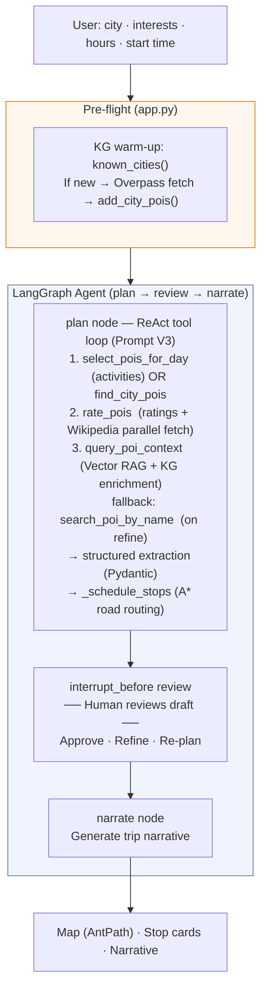
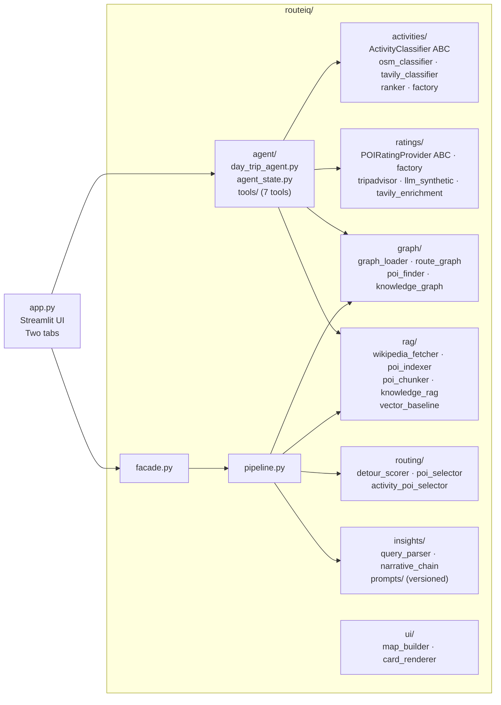

# RouteIQ

> Tell RouteIQ where you want to go and what you care about — it builds a time-scheduled, activity-matched day trip on a live map, complete with rated stops, Wikipedia context, and a written narrative. Refine with plain language ("skip museums", "add Lombard Street") until it's exactly your trip. Powered by a LangGraph ReAct agent, 4-layer RAG (Graph · Vector · Knowledge · Live), and Nebius `gpt-oss-120b-fast`.

<!-- Run /generate-demo-gif to produce this -->


---

## Quick Start

```bash
git clone <repo-url>
cd routeiq
pip install -r requirements.txt
cp .env.example .env          # edit with your API key
streamlit run app.py
```

**Required environment variables** (set in `.env`):

| Variable | Default | Description |
|---|---|---|
| `LLM_PROVIDER` | `anthropic` | `anthropic` or `nebius` |
| `LLM_MODEL` | `claude-sonnet-4-6` | Model name for the chosen provider |
| `ANTHROPIC_API_KEY` | — | Required when `LLM_PROVIDER=anthropic` |
| `NEBIUS_API_KEY` | — | Required when `LLM_PROVIDER=nebius` |
| `NEBIUS_API_BASE` | `https://api.tokenfactory.nebius.com/v1/` | Nebius OpenAI-compatible endpoint |
| `RATING_PROVIDER` | `llm_synthetic` | `llm_synthetic` (default, no key needed) · `tripadvisor` · `tavily_enrichment` |
| `ACTIVITY_PROVIDER` | `osm` | `osm` (default, no key needed) · `tavily` · `finetuned` (local Qwen3-1.7B, requires `FINETUNED_MODEL_PATH`) |
| `FINETUNED_MODEL_PATH` | `./models/intent` | Path to merged fine-tuned model weights (only used when `ACTIVITY_PROVIDER=finetuned`) |
| `TAVILY_API_KEY` | — | Required for `ACTIVITY_PROVIDER=tavily` and eval Run 2/3/5 |
| `TRIPADVISOR_API_KEY` | — | Required for `RATING_PROVIDER=tripadvisor` and eval Run 4/5 |

> **Bay Area cities load instantly** — road graphs, POI data, and rating caches for San Francisco, Oakland, Berkeley, San Jose, and Santa Cruz are bundled. Other cities trigger a one-time Overpass fetch (~15–30 s), then cache locally.

---

## Docs

| | |
|---|---|
| [Architecture](docs/DayTripPlanner/architecture.md) | LangGraph ReAct agent — tools, human-in-the-loop, Week 3→4 evolution |
| [Activity pipeline flow](docs/DayTripPlanner/activity-flow.md) | classify → rank → select → enrich → context → narrate, step by step |
| [Data flows](docs/DayTripPlanner/data-flows.md) | What data moves where across 4 scenarios (no activities, OSM, Tavily, edge case) |
| [Route Planner](docs/RoutePlanner/README.md) | Scenic corridor GraphRAG — sequence diagrams, eval results, pre-seeding guide |

---

## What It Does

Enter a city, pick interests, activities, hours, and start time. A LangGraph ReAct agent calls seven tools to find, activity-match, rank, and enrich Points of Interest, then schedules them in road-time-accurate order using A\* pathfinding. A human-in-the-loop interrupt lets you review the draft map + stop cards, refine with natural language ("Add Lombard Street", "Skip museums"), and approve before the narrative is written.

Supports any city — Bay Area corridors load instantly, other regions do a one-time Overpass fetch (~15–30 s) and cache locally.

> The app also includes a **Route Planner** tab for scenic corridor queries using 3-stage Graph RAG over OSM road networks. See [docs/RoutePlanner/README.md](docs/RoutePlanner/README.md) for full details.

---

## Architecture

### Day Trip Planner — Agent Flow



### RAG Layers — Day Trip Planner

| Layer | Tool | What it retrieves | When it runs |
|---|---|---|---|
| **Knowledge Graph RAG** | `find_city_pois` | RouteKnowledgeGraph in-memory lookup: City → POI → NEAR\_POI edges | Step 1 — instant, no network |
| **Live RAG** | `select_pois_for_day` | Tavily web search per (city, activity) → LLM name extraction across all candidates | Step 1 — when activities requested |
| **Vector RAG + KG enrichment** | `query_poi_context` | ChromaDB semantic search over Wikipedia chunks → KG city/region/nearby augment | Step 3 — after `rate_pois` |
| **Direct fetch** | inside `rate_pois` | Wikipedia API (parallel, cached) + TripAdvisor/LLM-synthetic ratings | Step 2 — enrichment, not RAG |

### Ratings Layer

```
rate_pois tool  (RATING_PROVIDER env var)
      │
      ├─── LLMSyntheticRatingProvider  (default — no API key needed, disk-cached)
      ├─── TripAdvisorRatingProvider   (real reviews + photos, RATING_PROVIDER=tripadvisor)
      └─── TavilyEnrichmentProvider    (web-sourced enrichment, RATING_PROVIDER=tavily_enrichment)
                │
                ▼
    composite_score = 0.4 × (rating/5) + 0.3 × log(reviews) + 0.3 × wikipedia_weight
    Top 30 returned → LLM selects 8–10 matching user preferences
```

### Module Layout



---

## Evaluation

### Week 5: Fine-tuned Intent Classifier

Replaces the 15-keyword substring bag (`_infer_activities_from_text`) with a fine-tuned **Qwen3-1.7B** model that understands natural language intent — catching queries the keyword bag silently misses.

**Problem:** queries like `"somewhere with a waterfall"`, `"rollercoasters and theme parks"`, or `"wine country tour"` return `activities=[]` from keyword matching, so `select_pois_for_day` never runs and the itinerary falls back to generic scenic stops.

**Solution:** 820 ShareGPT training examples generated via Claude Haiku, fine-tuned locally on M3 Max using LLaMA-Factory 0.9.3 (LoRA rank 8, 3 epochs, PyTorch 2.8.0 MPS). Final adapter loss: 0.32.

**Eval — 21 golden queries across 3 tiers** (`eval/intent_eval_golden.py`):

| Tier | Baseline (keyword bag) | Fine-tuned (Qwen3-1.7B) | Delta |
|---|---|---|---|
| Tier 1 — Easy (keyword bag should handle) | 4/5 (80%) | 4/5 (80%) | 0 |
| **Tier 2 — Semantic gap (key metric)** | **3/10 (30%)** | **9/10 (90%)** | **+6** |
| Tier 3 — Multi-label | 4/6 (67%) | 1/6 (17%) | −3 (expected: 85% single-label training data) |

**Headline:** `"rollercoasters and theme parks"` → keyword bag returns `picnic` (substring "park"), fine-tuned returns `kids`. That single example explains the whole project.

**Run the eval:**
```bash
# Regenerate merged model if models/intent/ is missing after a fresh clone
llamafactory-cli export config/export_intent_classifier.yaml

# Baseline vs fine-tuned comparison (21 queries, ~5s on MPS)
FINETUNED_MODEL_PATH=./models/intent python3 eval/intent_eval_golden.py

# Smoke test in the app
ACTIVITY_PROVIDER=finetuned FINETUNED_MODEL_PATH=./models/intent streamlit run app.py
```

**Assets committed:**
| File | What it is |
|---|---|
| `models/intent_adapter/` | LoRA adapter weights (33 MB, final loss 0.32) |
| `models/intent_adapter/training_loss.png` | Loss curve (3 epochs) |
| `data/intent_train.json` / `intent_val.json` | 656 train / 164 val ShareGPT examples |
| `scripts/generate_intent_training_data.py` | 820-example generator via Claude Haiku |
| `config/train_intent_classifier.yaml` | LLaMA-Factory LoRA config (rank 8, MPS) |
| `config/export_intent_classifier.yaml` | Merges adapter → `./models/intent/` |
| `routeiq/activities/finetuned_classifier.py` | `QueryIntentClassifier` — lazy-loads model, MPS/CUDA/CPU auto-detect |
| `eval/intent_eval_golden.py` | 3-tier golden eval with baseline comparison |

> **Note:** The merged model (`./models/intent/`, 6.7 GB) is excluded from git. Regenerate with `llamafactory-cli export config/export_intent_classifier.yaml`.

See [docs/DayTripPlanner/week5-submission.md](docs/DayTripPlanner/week5-submission.md) for the full write-up: problem, training data, iterations, and known gaps.

---

### Week 2: GraphRAG vs. Vector Baseline (Route Planner)
GraphRAG vs. vector-only comparison (10 queries) — see [docs/RoutePlanner/README.md](docs/RoutePlanner/README.md) for methodology and results.

### Week 4: Activity-Based Day Trip Eval

Evaluates the `select_pois_for_day` tool across 5 classifier × ratings configurations, 15 queries each (8 SF + 7 NYC).

```bash
python3 eval/run_week4_eval.py --limit 15
```

**Pass bars:** routing accuracy = 8/8 · recall ≥ 70% · p95 plan time < 90 s  
Results saved to `eval/results_week4.md`. Requires `NEBIUS_API_KEY` (and optionally `TAVILY_API_KEY` for Tavily configs).

**Results (15-query smoke test, all 5 configurations):**

| Config | Pass Rate | Tool Routing | Avg Recall | Avg Time |
|--------|-----------|---------|------------|----------|
| Run 1 OSM + LLM-Synth | 13/15 | **15/15** | 83% | 66.0 s |
| Run 2 Tavily + LLM-Synth | **15/15** | **15/15** | **100%** | 70.3 s |
| Run 3 Tavily + Enrich | 14/15 | **15/15** | 90% | 49.6 s |
| Run 4 OSM + TripAdvisor | 13/15 | **15/15** | 83% | 41.9 s |
| Run 5 Tavily + TripAdvisor | **15/15** | **15/15** | 97% | 43.8 s |

**Key findings:**
- Tool routing 15/15 (100%) across every configuration — all 9 improvements holding
- Tavily classifier +17% recall lift vs OSM (83% → 100%): finds parks as picnic via web content even without `leisure=picnic_site` OSM tags
- **Recommended config:** Run 5 (Tavily + TripAdvisor) — 15/15, 97% recall, 43.8 s, 38% real photos, avg rating 4.49
- **No-API-key fallback:** Run 1 (OSM + LLM-Synth) — 13/15, 83% recall, fully offline

**9 improvements implemented** across data pipeline, classifier, control flow, and prompt:
- ReAct iterations: 12 → 2–3 (pre-populated `visit_duration_min`)
- Plan time: ~226 s → ~30 s (warm caches, all fixes applied)
- Picnic gap: 0% recall in OSM configs, 100% in Tavily configs

Tool routing eval: 8/8 (100%) — see `eval/results_tool_routing.md`.
LLM-as-judge match quality (`avg_match_quality` 1–5): Track 1 activity stops rated by LLM on how well each stop suits the requested activity — see `eval/evaluators.py:score_activity_match_quality()`.

---

### Week 3: Agent Eval (Day Trip Planner)
End-to-end quality evaluation across 6 Bay Area queries.

```bash
python3 eval/run_agent_eval.py
```

Metrics: stop count · preference match % · faithfulness % · plan time · tool calls · refinement delta  
Results saved to `eval/results_week3.md`. Runtime ~15–30 min. Requires `ANTHROPIC_API_KEY` or `NEBIUS_API_KEY`.

**Results (latest run):**

| # | City | Preferences | Stop Count | Pref Match % | Faithful % | Plan Time | Tool Calls | Pass/Fail |
|---|------|-------------|------------|--------------|------------|-----------|------------|-----------|
| 1 | San Francisco, CA | history, art | 5 | 100% | 100% | 37s | 11 | PASS |
| 2 | San Francisco, CA | nature, outdoor, viewpoints | 7 | 100% | 14% | 31s | 3 | FAIL |
| 3 | Oakland, CA | food, art, waterfront | 5 | 67% | 100% | 15s | 6 | PASS |
| 4 | Berkeley, CA | nature, food, culture | 4 | 67% | 0% | 18s | 15 | FAIL |
| 5 | San Jose, CA | parks, food | 6 | 50% | 0% | 15s | 1 | FAIL |
| 6 | SF — refinement test | history, museums | 5 | 100% | 100% | 150s | 6 | PASS |

**Refinement (Query 6):** "Skip museums, add beaches and waterfront stops instead"

| Phase | Stops | Beach stops | Museum stops | Delta % |
|-------|-------|-------------|--------------|---------|
| Before | 5 | 1 | 4 | — |
| After | 8 | 3 | 0 | 92% |

Verdict: **YES** — beach preference gained, museums eliminated. Confirms Phase 1+2 refinement fix works end-to-end.

PASS threshold: `stops >= floor(hours/2)` (scales with budget — agent trims stops that exceed it) AND `pref_match >= 50%` AND `faithfulness >= 50%`.

**Key finding:** 3/6 PASS. All 3 failures are faithfulness = 0% — Berkeley and San Jose POIs have sparse review data in the LLM synthetic cache, so stops lack `visitor_quote` and ratings. Preference match is strong (81% avg). Stop count is not a failure mode: 4–7 stops for a 5–7 hour trip is correct after budget trimming.

---

## Design Patterns Applied

| Pattern | Where |
|---|---|
| **Pipeline** | `DayTripAgent` ([routeiq/agent/day_trip_agent.py](routeiq/agent/day_trip_agent.py)) — LangGraph ReAct agent: plan → review (interrupt) → narrate. |
| **Strategy** | `POIRatingProvider` ABC ([routeiq/ratings/base.py](routeiq/ratings/base.py)) — `TripAdvisorRatingProvider`, `LLMSyntheticRatingProvider`, `TavilyEnrichmentProvider` are interchangeable via `RATING_PROVIDER` env var. `ActivityClassifier` ABC ([routeiq/activities/base.py](routeiq/activities/base.py)) — `OSMActivityClassifier` and `TavilyActivityClassifier` are interchangeable via `ACTIVITY_PROVIDER` env var. `DetourScorer` ([routeiq/routing/detour_scorer.py](routeiq/routing/detour_scorer.py)) — swappable scoring algorithm. |
| **Factory** | `RatingsFactory` ([routeiq/ratings/factory.py](routeiq/ratings/factory.py)) — constructs the active rating provider from env var. `ActivityClassifierFactory` ([routeiq/activities/factory.py](routeiq/activities/factory.py)) — constructs the active activity classifier from env var. |
| **Facade** | `RouteIQFacade` ([routeiq/facade.py](routeiq/facade.py)) — single entry point for the Route Planner tab; see [docs/RoutePlanner/README.md](docs/RoutePlanner/README.md). |
| **Registry** | `RouteKnowledgeGraph` ([routeiq/graph/knowledge_graph.py](routeiq/graph/knowledge_graph.py)) — typed node/edge graph of POI, City, Region, Category with LOCATED\_IN / HAS\_CATEGORY / NEAR\_POI edges. `get_kg()` singleton ensures all callers share one in-memory graph. |
| **Builder** | `MapBuilder` ([routeiq/ui/map_builder.py](routeiq/ui/map_builder.py)) — assembles Folium map with AntPath route, numbered markers, and stop popups. |
| **Dependency Injection** | LLM (`ChatOpenAI` via Nebius / `ChatAnthropic`) injected into all AI components — every class is independently testable with mocks. |

---

## Testing

```bash
python3 -m pytest tests/ -v
```

**315 tests across 24 test files.** Coverage includes:

| Area | Test files |
|---|---|
| Day Trip Agent — scheduling, budget trimming, ReAct loop | `tests/agent/test_day_trip_agent.py` |
| Agent tools — find POIs, rate, enrich, search by name | `tests/agent/test_tools.py` |
| Activity classifier — OSM + Tavily, ranker, factory | `tests/test_activity_poi_selector.py` |
| `query_poi_context` tool — chunk+index + KnowledgeRAG integration | `tests/test_knowledge_rag.py` (existing KnowledgeRAG coverage) |
| Tool routing eval — score_tool_routing() | `tests/test_tool_routing_eval.py` |
| Ratings — TripAdvisor, LLM synthetic, Tavily enrichment, factory | `tests/ratings/` (4 files) |
| Graph loading + pickle cache | `test_graph_loader.py` |
| A\* pathfinding | `test_route_graph.py` |
| POI spatial join | `test_poi_finder.py` |
| Knowledge graph — edges, enrichment, city expansion | `test_knowledge_graph.py` |
| Detour scoring + POI selection | `test_detour_scorer.py`, `test_poi_selector.py` |
| Wikipedia fetch + enrichment | `test_wikipedia_fetcher.py` |
| ChromaDB indexing + retrieval | `test_poi_indexer.py`, `test_poi_retriever.py` |
| 3-stage GraphRAG pipeline | `test_knowledge_rag.py` |
| Query parser, narrative chain, fallback | `test_query_parser.py`, `test_narrative_chain.py`, `test_fallback_chain.py` |
| LangGraph pipeline nodes + edges | `test_pipeline.py` |
| Vector baseline | `test_vector_baseline.py` |

---

## Project Structure

```
app.py                        Streamlit UI — Day Trip Planner (agent) + Route Planner tabs
routeiq/
  agent/
    day_trip_agent.py         LangGraph ReAct agent — plan / review (interrupt) / narrate nodes
    agent_state.py            DayTripState TypedDict
    tools/
      find_city_pois.py       READ: KG lookup — returns POIs for a city
      rate_pois.py            READ: enriches POIs with ratings, ranks by composite score
      enrich_poi_details.py   READ: Wikipedia intro + thumbnail per POI
      estimate_visit.py       READ: typical visit duration by OSM subtype
      search_poi_by_name.py   READ: Nominatim geocoder — resolves named places to lat/lon
      select_pois_for_day.py  READ: activity-based POI selection via two-track merge
      query_poi_context.py    READ: chunk+index Wikipedia descriptions → KnowledgeRAG semantic retrieval + KG enrichment
      get_travel_time.py      READ: A* road-time between two lat/lon points
  ratings/
    base.py                   POIRatingProvider ABC + RatedPOI dataclass
    factory.py                RatingsFactory — selects provider from RATING_PROVIDER env var
    llm_synthetic.py          LLM-generated ratings, disk-cached per city, 21-day TTL (default)
    tripadvisor.py            TripAdvisor Terra API adapter
    tavily_enrichment.py      Tavily-based enrichment provider (RATING_PROVIDER=tavily_enrichment)
  graph/
    knowledge_graph.py        nx.DiGraph of POI/City/Region/Category; get_kg() singleton
    knowledge_graph_data.py   Bay Area seed data
    graph_loader.py           OSMnx road network download + pickle cache
    route_graph.py            NetworkX A* shortest path
    poi_finder.py             Overpass POI query + corridor spatial join + polygon clip
    poi.py                    POI dataclass
    route_result.py           RouteResult dataclass
  rag/
    wikipedia_fetcher.py      Wikipedia intro + thumbnail URL per POI
    poi_indexer.py            ChromaDB collection management
    knowledge_rag.py          3-stage GraphRAG: vector → graph augment → context
    vector_baseline.py        Pure semantic baseline (no graph) for evaluation
  activities/
    base.py                   ActivityClassifier ABC + ActivityMatch dataclass
    factory.py                ActivityClassifierFactory — selects provider from env var
    osm_classifier.py         OSM-tag-based activity classifier (offline)
    tavily_classifier.py      Tavily web-search activity classifier (richer coverage)
    finetuned_classifier.py   QueryIntentClassifier — fine-tuned Qwen3-1.7B intent classifier (ACTIVITY_PROVIDER=finetuned)
    ranker.py                 ActivityRanker — two-track merge of activity + scenic POIs
  routing/
    detour_scorer.py          Straight-line detour cost per POI (Strategy)
    poi_selector.py           Top-N selection with category weighting
  insights/
    query_parser.py           NL query → {origin, destination, preferences}
    narrative_chain.py        Route + POIs → streaming narrative
    prompts/                  Versioned ChatPromptTemplates
  ui/
    map_builder.py            Folium map with AntPath route + markers (Builder)
    card_renderer.py          Stop card HTML — photos, ratings, visitor quote, hours
  facade.py                   RouteIQFacade — Route Planner entry point (see docs/RoutePlanner/README.md)
  pipeline.py                 RoutePipeline — Route Planner LangGraph pipeline (see docs/RoutePlanner/README.md)
  llm_factory.py              create_llm() — Anthropic / Nebius via env var
cache/
  graphs/                     OSMnx road network pickles (Bay Area pre-seeded)
  pois/                       POI JSON.GZ caches (bay_area_all.json.gz + per-route)
  ratings/                    LLM synthetic rating caches per city
  chroma/                     ChromaDB persistent store (pre-populated)
eval/
  evaluator.py                10-query GraphRAG vs vector baseline harness
  run_eval.py                 CLI runner
  agent_eval_queries.py       6 agent evaluation test cases + PREFERENCE_KEYWORDS map
  agent_evaluator.py          stop count · pref match · faithfulness · refinement delta scoring
  run_agent_eval.py           CLI runner — saves eval/results_week3.md
  run_week4_eval.py           Week 4 CLI runner — 5-config × N-query eval, saves eval/results_week4.md
  evaluators.py               LLM-as-judge recall + routing pass scorers
  langsmith_dataset.py        LangSmith dataset push helpers
  run_tool_routing_eval.py    Tool routing golden eval (8 cases)
  tool_routing_queries.py     8 golden tool routing cases
  results_week4.md            Latest smoke test results (5 configs × 15 queries)
  results_tool_routing.md     Tool routing eval results (8/8)
tests/                        315 unit tests across 24 files
docs/
  RoutePlanner/               Route Planner docs (Weeks 1–2)
  DayTripPlanner/             DayTripPlanner docs (Weeks 3–4) — architecture, data flows, submissions
```

---

## Documentation

| File | Contents |
|---|---|
| [docs/DayTripPlanner/week5-submission.md](docs/DayTripPlanner/week5-submission.md) | Week 5 fine-tuned intent classifier — problem, training data, LLaMA-Factory workflow, eval results, known gaps |
| [docs/DayTripPlanner/architecture.md](docs/DayTripPlanner/architecture.md) | DayTripPlanner agent architecture — LangGraph ReAct loop, tools, human-in-the-loop, Week 3→4 evolution |
| [docs/DayTripPlanner/activity-flow.md](docs/DayTripPlanner/activity-flow.md) | Activity pipeline walkthrough — classify → rank → select → enrich → context → narrate |
| [docs/DayTripPlanner/data-flows.md](docs/DayTripPlanner/data-flows.md) | End-to-end data flows for 4 scenarios: no activities, OSM, Tavily, edge case |
| [docs/RoutePlanner/README.md](docs/RoutePlanner/README.md) | Full Route Planner architecture, sequence diagrams, pre-seeding guide |
| [docs/RoutePlanner/rag-graphrag.md](docs/RoutePlanner/rag-graphrag.md) | RAG and GraphRAG explained from first principles using RouteIQ as the example |
| [docs/DayTripPlanner/week3-submission.md](docs/DayTripPlanner/week3-submission.md) | Week 3 agent framework, all prompts, iterations, learnings |
| [docs/DayTripPlanner/week4-submission.md](docs/DayTripPlanner/week4-submission.md) | Week 4 activity eval — 5-config matrix, 9 improvements, full results |
| [docs/RoutePlanner/architecture-decisions.md](docs/RoutePlanner/architecture-decisions.md) | Architecture decisions log for the Route Planner (Weeks 1–2) |
| [prompts.md](.claude/prompts.md) | Running log of every prompt iteration — what changed and why |

---

Built with [LangGraph](https://langchain-ai.github.io/langgraph/) · [LangChain](https://python.langchain.com) · [OSMnx](https://osmnx.readthedocs.io) · [NetworkX](https://networkx.org) · [ChromaDB](https://docs.trychroma.com) · [Streamlit](https://streamlit.io) · [Folium](https://python-visualization.github.io/folium/) · [Nebius gpt-oss-120b-fast](https://tokenfactory.nebius.com)
