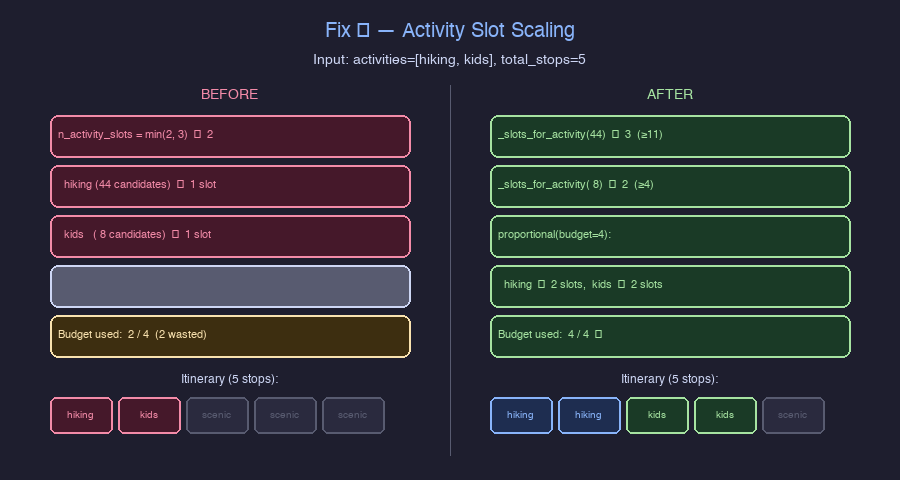
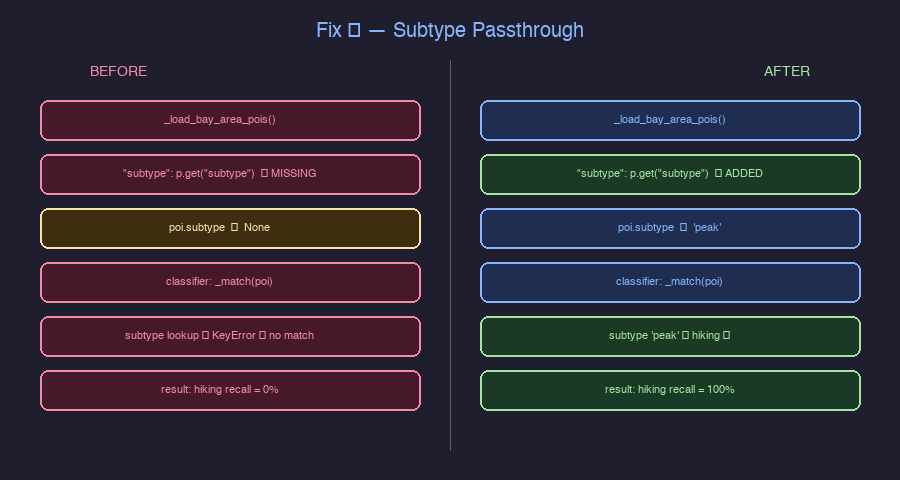
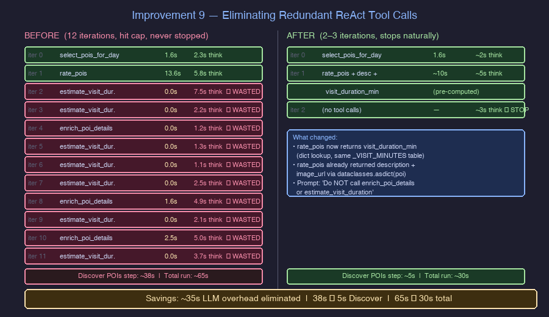

# RouteIQ — Architecture and Design Decisions

Running log of every significant architectural and design decision made during the project.
Format: Decision → Why → Alternatives considered → Trade-offs accepted.

---

## Graph Layer

### Graph RAG over plain RAG
**Decision:** Use the road network graph as the retriever, not semantic similarity alone.
**Why:** Plain RAG has no concept of "along a route." A query like "scenic stops between Austin and San Antonio" requires knowing which landmarks are spatially adjacent to the route — that is a graph problem, not a similarity problem. The graph does spatial reasoning; the LLM does language.
**Alternatives considered:** Pure vector RAG (ChromaDB only), hybrid keyword + semantic search.
**Trade-off accepted:** More complex retrieval pipeline, but spatial truth is non-negotiable for this use case.

### NetworkX over Neo4j
**Decision:** NetworkX in-memory graph for Week 1.
**Why:** Neo4j requires a running server, schema setup, and Cypher queries. NetworkX loads directly from OSMnx, stays in memory, and supports A*/shortest_path natively. The graph algorithms are identical — the infra overhead is not worth it for a one-week MVP.
**Alternatives considered:** Neo4j (deferred), Amazon Neptune, TigerGraph.
**Trade-off accepted:** Single-machine scale only. Revisit Neo4j when multi-city persistence or graph size exceeds memory.

### OSMnx as the road network source
**Decision:** OSMnx to load OpenStreetMap data.
**Why:** Free, global, rich attributes (road class, speed, POI tags, Wikipedia links). No API key required. Load any region by city name or bounding box. POI layer includes tourism, historic, natural features with `wikipedia` tag for RAG grounding.
**Alternatives considered:** Google Maps API (paid, proprietary), HERE Maps (paid), synthetic data (no real landmarks).
**Trade-off accepted:** OSMnx data quality depends on OSM contributor coverage — rural areas may have sparse POIs.

### OSMnx pinned to >=2.0
**Decision:** Pin `osmnx>=2.0` in requirements.txt.
**Why:** OSMnx 2.x changed `graph_from_bbox` and `features_from_bbox` to use `bbox=(west, south, east, north)` tuple. Pinning ensures all developers get the same API — no runtime version detection shim needed. Anyone who clones the repo and runs `pip install -r requirements.txt` gets an identical environment.
**Alternatives considered:** No version pin (requires runtime shim to handle 1.x vs 2.x), pin to exact version `==2.x.y` (too brittle for patch updates).
**Trade-off accepted:** Blocks install on Python environments where only osmnx 1.x is available — unlikely for a fresh install.

### A* pathfinding with per-edge travel times
**Decision:** Use `nx.astar_path()` with `weight="travel_time"` (seconds per edge) and a haversine/max-speed heuristic. Edge travel times are computed once at graph-load time via `ox.add_edge_speeds()` + `ox.add_edge_travel_times()`.
**Why:** A* with `weight="length"` finds the *shortest* road in meters, which is not the same as the *fastest* route — a longer highway is often faster than a short residential street. OSMnx fills each edge with a `speed_kph` derived from the OSM `maxspeed` tag (falling back to road-type defaults: motorway=130, residential=30, etc.) and computes `travel_time = length / speed_kph` in seconds. Summing these gives realistic drive-time estimates without a flat global average.
**Heuristic:** `haversine_distance_m / 36.11 m/s` (130 km/h = fastest OSM road type). This is admissible — it never overestimates travel time — so A* is still guaranteed optimal.
**Alternatives considered:** `weight="length"` + flat 50 km/h (fast but inaccurate for mixed road types), OSRM (accurate but requires a running server), flat-speed per road class (approximation, more complex than OSMnx's built-in).
**Trade-off accepted:** `add_edge_speeds` runs in-memory on every graph load (~50–200 ms for a city-scale graph). Results are not persisted to the pkl cache, so the cost is paid once per process startup. Acceptable for a local demo.

### Shapely buffer for POI spatial join
**Decision:** Buffer the route LineString by `buffer_km/111` degrees, then test POI centroids with `.contains()`.
**Why:** The route is a polyline (~2000 GPS points). A simple bounding box over-fetches POIs in corners far from the route. The Shapely buffer creates a precise "sausage shape" that only includes landmarks actually near the road.
**Alternatives considered:** Bounding box only (over-includes), per-point radius check (O(n×m) complexity), projected CRS buffer (more accurate but adds projection complexity).
**Trade-off accepted:** The `/ 111.0` degree conversion is approximate (~7% error at 30°N latitude). Acceptable for a 5km buffer; revisit if precision matters.

### Disk caching for OSMnx graph
**Decision:** Cache downloaded graphs to `./cache/graphs/{key}.graphml` on first load.
**Why:** The Austin→San Antonio corridor graph is ~100MB and takes 2-5 minutes to download from the Overpass API. Without caching, every restart pays this cost. With caching, subsequent loads are instant.
**Alternatives considered:** In-memory only (lost on restart), database persistence (overengineered for Week 1), OSMnx's built-in cache (less control over cache key and location).
**Trade-off accepted:** `cache/` directory must be gitignored (large binary files). First-time setup takes 2-5 minutes.

---

## RAG Layer

### ChromaDB for vector store
**Decision:** ChromaDB local with default embeddings (no external API for embedding).
**Why:** Local, no server, no API key, works offline. LangChain native integration. For Week 1, retrieval is mostly by POI ID — the graph pre-filters spatially, RAG just fetches the document. Semantic search is only used for intent extraction from the NL query. A cloud vector DB adds infra complexity for no Week 1 benefit.
**Alternatives considered:** Pinecone (cloud, API key required), Weaviate (requires server), FAISS (no metadata filtering).
**Trade-off accepted:** Single-machine only. Swap to Pinecone/Weaviate when multi-user or cloud deployment needed. Swap is one line at the entry point due to DI pattern.

### Wikipedia as the RAG corpus
**Decision:** Fetch Wikipedia article intro + thumbnail image per POI using the Wikipedia API.
**Why:** OSMnx POIs often have a `wikipedia` tag linking to the article. Wikipedia intros are concise (1-3 paragraphs), consistently structured, and freely available. The thumbnail provides a visual for stop cards.
**Alternatives considered:** OSM description tags (too sparse), web scraping (fragile), synthetic descriptions (no real content).
**Trade-off accepted:** Wikipedia coverage is uneven — minor POIs may lack articles. Handle gracefully: if no Wikipedia article, skip image and use OSM tags only.

### Two-layer retrieval (Graph RAG + Vector RAG)
**Decision:** Graph first (spatial truth), then vector (language grounding), then LLM (narrative).
**Why:** RAG alone would hallucinate "nearby" without spatial truth. Graph alone would return dry node IDs without language. Both layers are necessary:
- Graph RAG: find which POIs are actually on the route → spatial ground truth
- RAG: fetch rich descriptions for those POIs → language context for the LLM
- LLM: synthesize into narrative → user-facing answer
**Alternatives considered:** Graph only (no rich descriptions), RAG only (no spatial filtering), single-hop retrieval (no graph traversal).
**Trade-off accepted:** Two retrieval steps add latency. Acceptable for a route planning use case (not real-time).

---

## Pipeline Orchestration

### LangGraph state machine over plain Pipeline class
**Decision:** Wire the pipeline as a LangGraph state machine with named nodes and conditional edges.
**Why:** The pipeline has natural branching: no POIs found → fallback, route too long → warning, unparseable query → error. LangGraph conditional edges handle these cleanly. A plain Pipeline class would need ad-hoc if/else branching. LangGraph also matches Track 2 deliverable language ("LangGraph state machines").
**Alternatives considered:** Plain Pipeline class (simpler but no conditional routing), LangChain LCEL only (no stateful graph), Airflow/Prefect (overengineered).
**Trade-off accepted:** Additional framework to learn. LangGraph has steeper ramp than a plain class but the conditional edge benefit justifies it.

---

## LLM and Prompt Layer

### Claude Sonnet 4.6 as the LLM
**Decision:** Claude Sonnet 4.6 via `langchain-anthropic` (`ChatAnthropic`).
**Why:** Best narrative quality for travel descriptions. Already have the API key. LangChain integration is first-class.
**Alternatives considered:** GPT-4o (OpenAI, paid separately), Llama via Nebius (open-source, cheaper), Gemini.
**Trade-off accepted:** Anthropic API cost. Nebius swap is one line at the entry point if required by cohort.

### Prompt registry pattern
**Decision:** One `ChatPromptTemplate` per file in `routeiq/insights/prompts/`, versioned explicitly (`PROMPT_V1`, `PROMPT_V2`), active version aliased (`PROMPT = PROMPT_V2`).
**Why:** Prompts are code artifacts — they should be version-controlled, readable, testable, and swappable. Hardcoded prompt strings inside class methods are untestable and invisible in git diffs.
**Alternatives considered:** Prompts hardcoded in chain methods (untestable), LangSmith prompt hub (Week 2 scope), YAML prompt files (adds parsing layer).
**Trade-off accepted:** More files to maintain. Each new prompt domain requires a new file + examples file + test stub.

### Dependency injection for the LLM
**Decision:** Create the LLM once at the entry point, inject it into all AI classes.
**Why:** Makes every AI class unit-testable with a mock LLM. Makes provider swap (Claude → Nebius → OpenAI) a one-line change at the entry point with zero changes inside `routeiq/`.
**Alternatives considered:** Singleton LLM (hidden global state), instantiate inside each class (untestable, hard to swap).
**Trade-off accepted:** Slightly more wiring at the entry point. Worth it for testability and provider flexibility.

---

## UI

### Folium for map rendering
**Decision:** Folium for the route map and POI markers.
**Why:** Pure Python, no frontend build step, renders to standalone HTML. Works in Jupyter, Streamlit, and as a file. Fast to prototype.
**Alternatives considered:** Deck.gl (requires React), Leaflet.js (requires frontend), Google Maps (API key + paid), Kepler.gl (heavy).
**Trade-off accepted:** Limited interactivity compared to JavaScript maps. Swap on Day 4 if richer interaction is needed.

### UI framework deferred
**Decision:** UI framework (Streamlit vs FastAPI+React) not locked until Day 4.
**Why:** The core Graph RAG logic (Days 1-3) is framework-agnostic. Locking the UI framework early constrains architectural decisions unnecessarily.
**Alternatives considered:** Streamlit (fast, Python-only), FastAPI+React (richer map interaction, more setup), CLI only (fastest to build, weakest demo).
**Trade-off accepted:** Day 4 may require more wiring if a non-Streamlit framework is chosen.

---

## Out of Scope (Week 1)

| Feature | Reason deferred |
|---|---|
| Real-time traffic | Static OSM sufficient to prove Graph RAG concept |
| LangSmith observability | Week 2 scope |
| Evals framework | Week 2 scope — need (query, context, answer) pairs from running system first |
| Fine-tuning | Requires training data from the running system |
| Neo4j | NetworkX sufficient for single-machine Week 1 |
| Auth, saved routes | Week 2+ scope |
| Cloud deployment | Week 2+ scope |

---

## Week 4 — Evaluation & Activity Layer

### Two-track POI merge over single-ranked list

**Decision:** `select_pois_for_day` uses a **two-track merge**: Track 1 = activity-matched slots (proportional to pool size), Track 2 = scenic fills for remaining slots.
**Why:** A single ranked list sorted by activity match crowds out scenic diversity. A trip with `["hiking"]` and 30 hiking POIs should still include a museum or viewpoint. The two-track budget guarantees variety.
**Trade-off accepted:** The proportional slot formula (1 slot for 1–4 matches, 2 for 5–10, 3+ for larger) was chosen by inspection — not learned from data. A reinforcement-learning approach could optimize this but is out of scope.

### OSM tag classifier as the default over Tavily

**Decision:** `ACTIVITY_PROVIDER=osm` is the default. Tavily is opt-in via env var.
**Why:** OSM tags (`peak`, `beach`, `playground`, `cycling_path`) map directly to activities with zero latency and zero API cost. Tavily adds lift for POIs with ambiguous tags (e.g., a "nature reserve" known for kayaking that has no explicit tag) but costs money per query and adds 5–20s to planning time.
**Alternatives considered:** Tavily-only (better recall, higher cost), hybrid always-on (expensive, no marginal gain on well-tagged cities like SF).
**Trade-off accepted:** OSM classifier misses activity-tagged POIs that lack OSM subtypes (e.g., a community pool without `leisure=swimming_pool`). Evaluated as acceptable given 44 SF hiking POIs discovered vs 0 before the fix.

### Subtype passthrough in KG loader (Bug fix, not original design)

**Decision:** KG loader now passes `"subtype": p.get("subtype")` from raw OSM data into `POI` objects.
**Why this was a bug:** The original loader dropped `subtype`, so `OSMActivityClassifier._match()` always searched an empty string — 0 matches for every activity.

**Lesson:** Tracing data lineage from raw OSM → `POI` → `ClassifiedPOI` → `ToolMessage` was the only way to find this. The bug was invisible at the agent level because `select_pois_for_day` returned POIs (just none with `matched_activities`).

### rate_pois returns visit_duration_min (Improvement 9)

**Decision:** `rate_pois` now pre-populates `visit_duration_min` using the same `_VISIT_MINUTES` table as `estimate_visit_duration`. The V2 prompt bans calling `estimate_visit_duration` and `enrich_poi_details` separately.
**Why:** The LLM was calling `estimate_visit_duration` 7× per run and `enrich_poi_details` 3×, both returning data already present in the `rate_pois` output. Each wasted iteration cost 1–8s of LLM inference. Total wasted per run: ~35s.
**Result:** 12 iterations → 2–3; `total_react` from ~55s to ~37s.

### LLM-as-judge only for match quality, not routing or recall

**Decision:** Code-based evaluators for tool routing and activity recall; LLM-as-judge only for `avg_match_quality` (1–5 score per matched stop).
**Why:** Tool routing is binary — either `select_pois_for_day` was called first or it wasn't. Activity recall is keyword-based. Both are fully deterministic and fast. LLM-as-judge adds value where nuance matters: "Does this viewpoint really suit hiking?" can't be answered by keyword matching.
**Trade-off accepted:** LLM-as-judge is skipped when no API key is present (`judge_llm=None`) — graceful degradation to code-only scoring.

### 5-configuration eval matrix over A/B test

**Decision:** Compare 5 configurations (2 classifiers × 3 rating providers, minus 1 duplicate) instead of a single A/B pair.
**Why:** Three independent variables (activity classifier, rating provider, enrichment depth) interact. A single A/B test can attribute improvement to the wrong variable. The 5-run matrix isolates each variable: Runs 1→2 = classifier lift, Runs 1→4 = rating provider lift, Run 5 = combined best-of-all.
**Trade-off accepted:** 150 agent calls (~5–8 hours) vs ~30 for a single A/B. Acceptable for a one-time evaluation; would add continuous eval monitoring in production.

### Wikipedia write-race (known issue, deferred)

**Decision:** Not fixing the `_write_cache` write race in `WikipediaFetcher` for Week 4.
**Why:** The race only manifests with 6+ concurrent threads, and the impact is a shorter cache snapshot (11 entries instead of 22), not corrupt data. The cache rebuilds on subsequent runs. Fix is straightforward (`_cache_lock` around `_write_cache`) but adds complexity without changing eval outcomes.
**Deferred until:** Production deployment, or if cache thrashing becomes measurable during eval.
